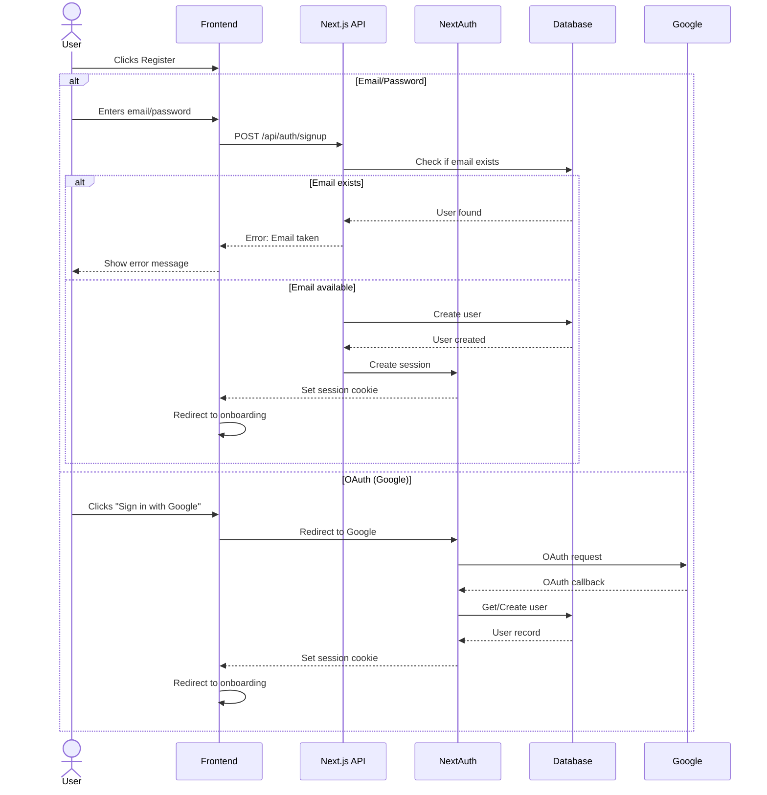
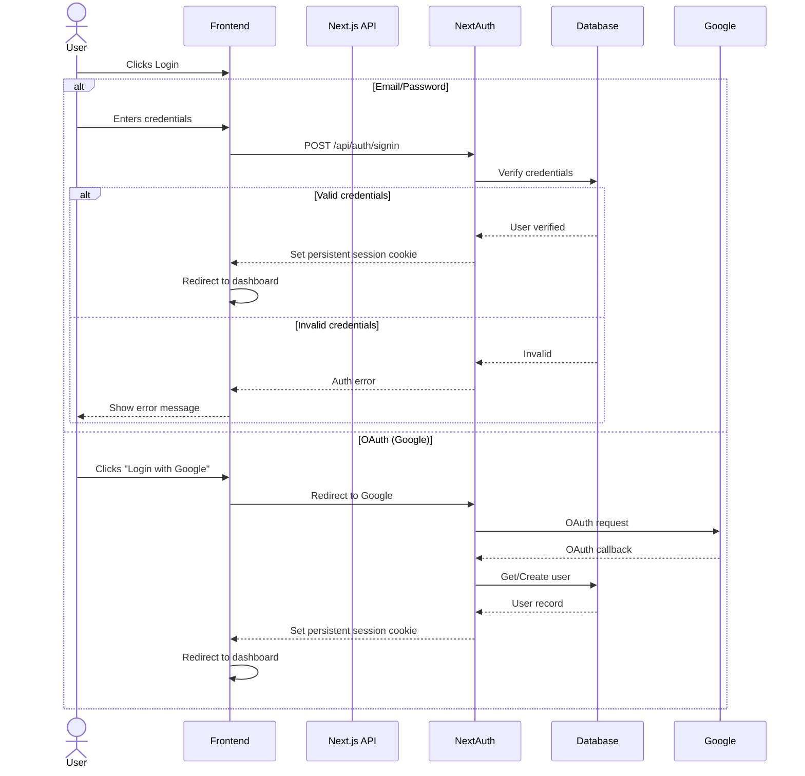
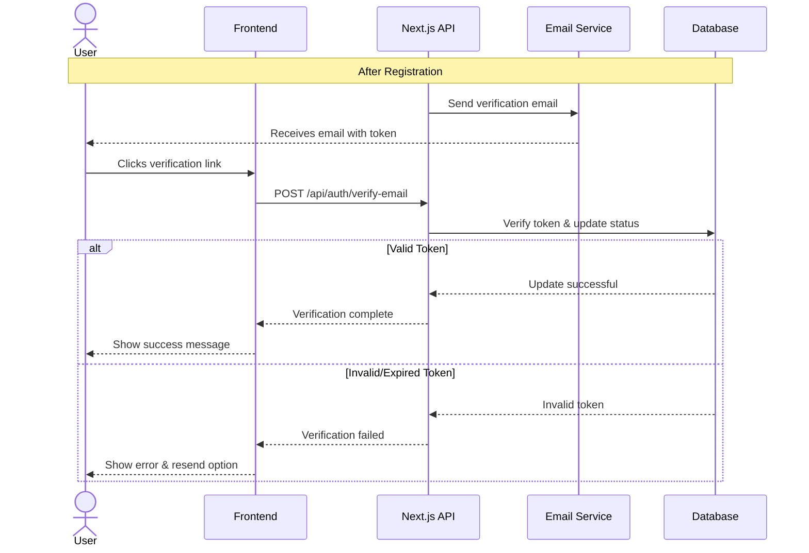
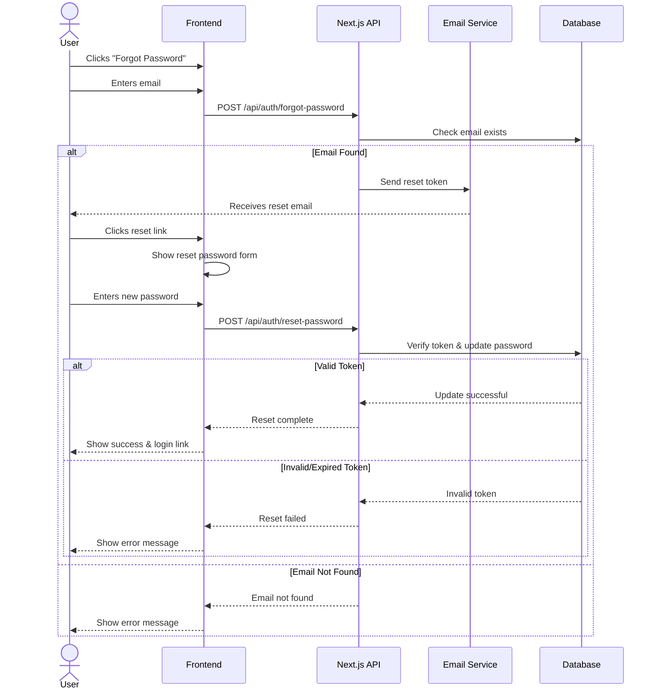
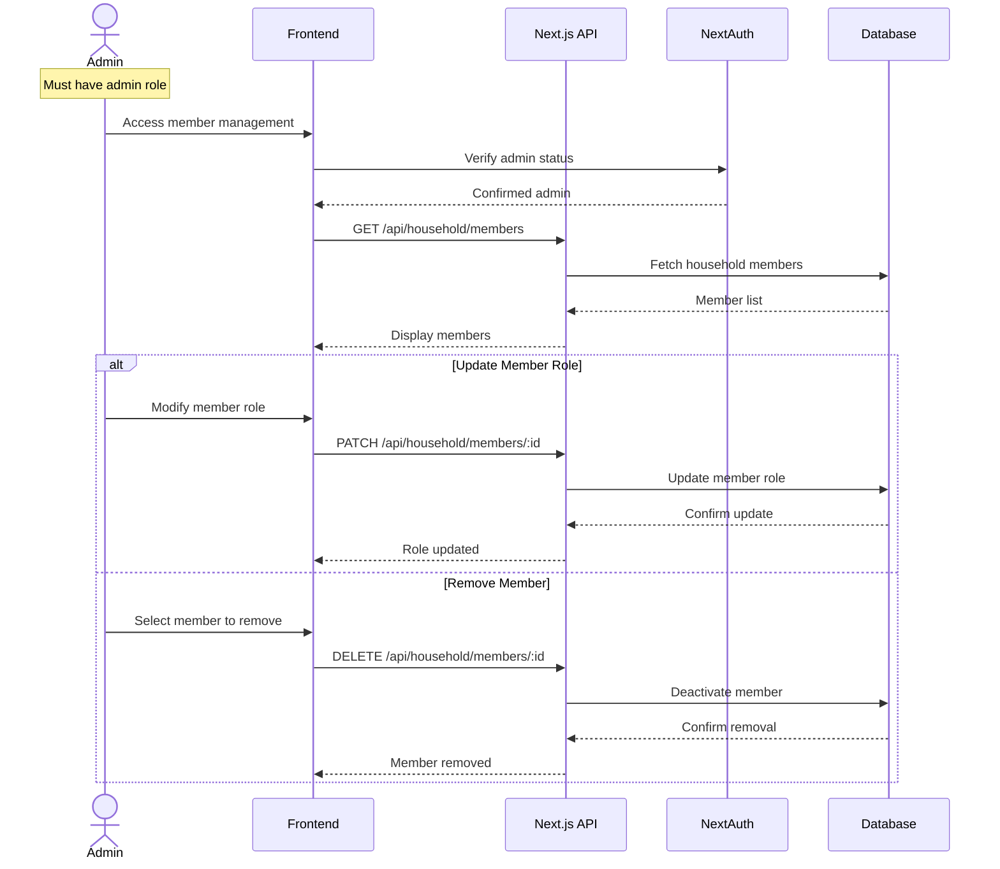

# Authentication Flows

This document outlines the authentication flows for the Household Chore
Gamification System. While these diagrams may seem formal for a household
application, they provide clear documentation for implementation and future
maintenance.

## Registration Flow

## Login Flow

## Email Verification Flow

## Password Reset Flow

## Household Admin Management Flow

## Implementation Notes

1. **Session Persistence**

   - Sessions remain active indefinitely for better household usability
   - Users only need to log in again after explicitly logging out
   - Password changes will invalidate all active sessions

2. **OAuth Provider**

   - Initially supporting Google authentication
   - Additional providers can be added based on household needs

3. **Error Handling**

   - Clear error messages for users
   - Proper handling of network issues
   - Graceful fallbacks for OAuth failures

4. **Redirects**
   - New users go through onboarding
   - Existing users go directly to dashboard
   - Failed attempts remain on login/register page with error messages
